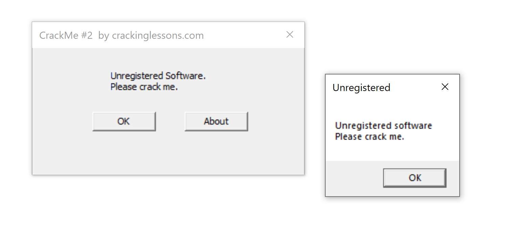
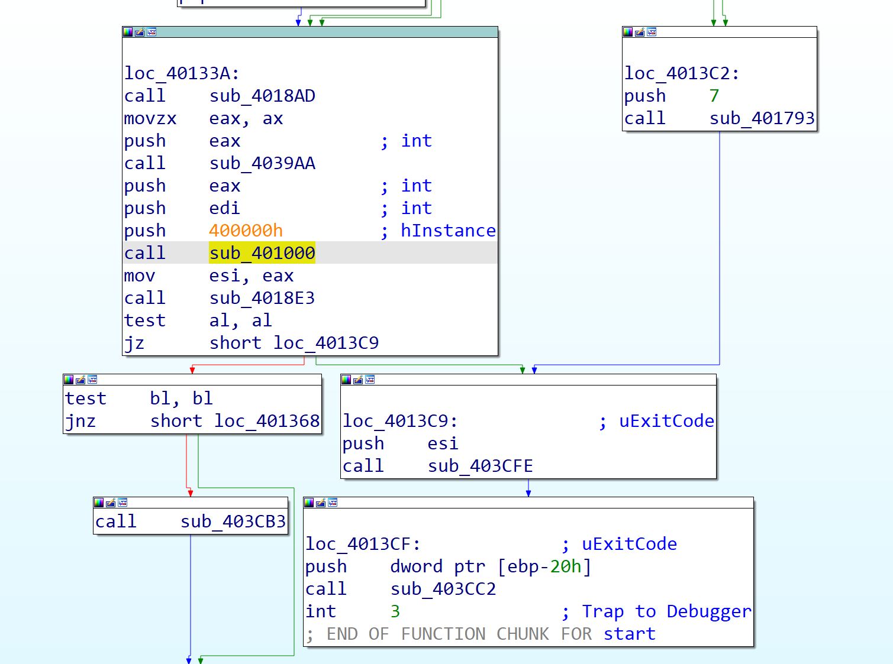
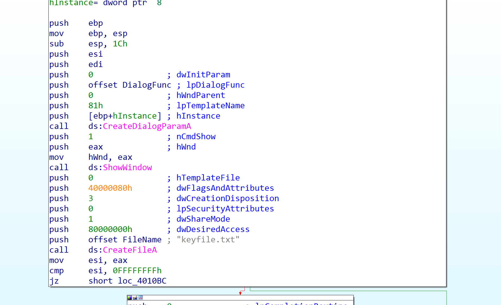
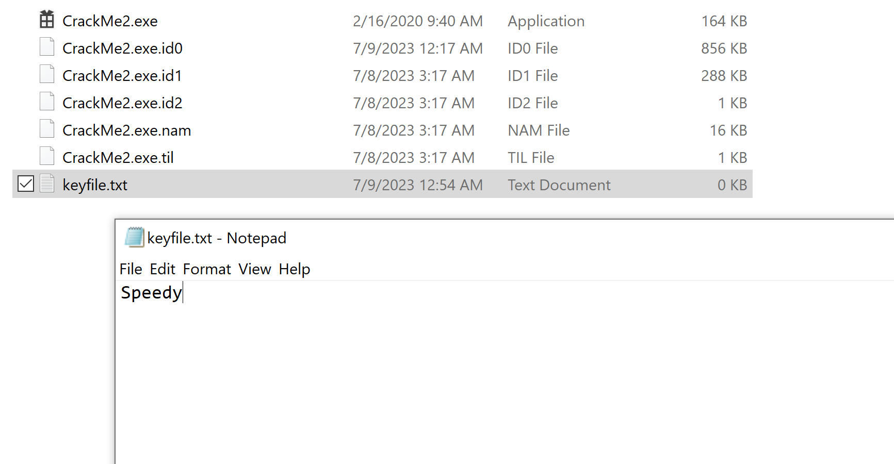
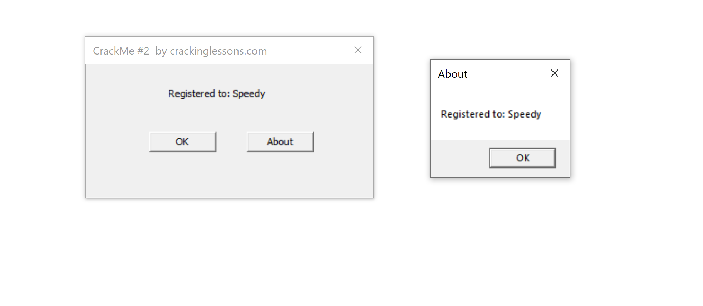

When we run the file "CrackMe2" it shows that it is not registered  

  
Let's disassemble in IDA and got to the start point  

  
There are a few functions for creating a dialogue and there is an interesting function called CreateFileA which creates or opens a file  
In this case it searches for a file called "keyfile.txt"  

  
It checks if the file exists, it will return a value in eax and compare it with esi which has rthe value of (-1)  
if the file exists, it will take the left path to read what is written in the file and create a new string "Registered to: " and append the file content   
So, we need to create a file with that name with and write the registrer name inside  

  
Let's run again  

