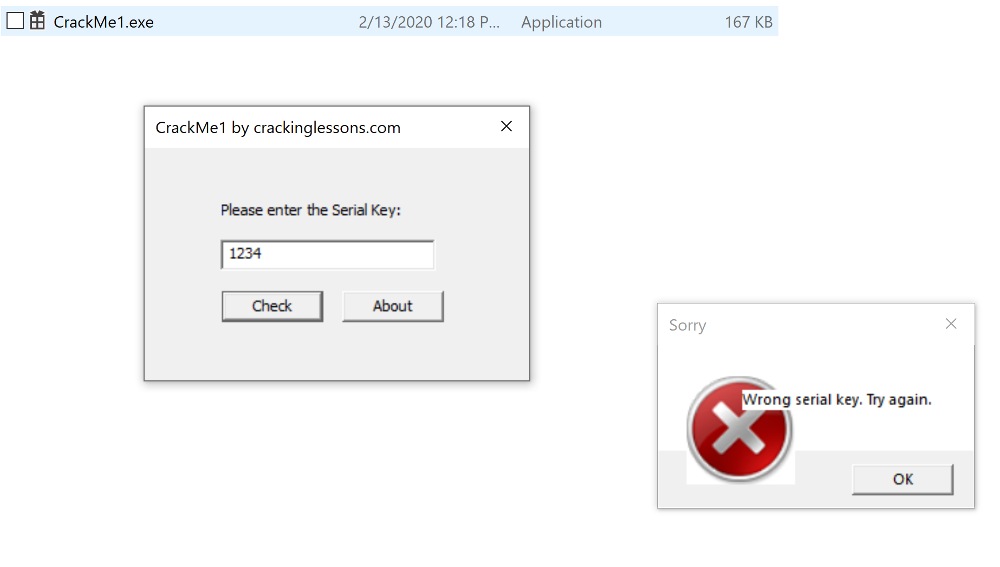

After downloading and extracting the file, we get a file caaled CrackMe1.exe  
The file asks for a serial key, Entered a random key but it was wrong  

  
Let's disassemble on IDA and go to strings View -> Open subviews -> Strings or Shift+F12  
Found some intersting keywords including the key  
 
  
Let's try it  
  
  
Now let's try to patch it like whenever we enter any key, it will work  
Let's go to the success function by double-click on the function next to the string "Congrats!"  
We need to force the flow to take the left path to execute (xor eax,eax) and go to the congrats function  
 
  
Create a breakpoint (F2)  
  
  
Now, let's run then it will ask us for the key, we enter any number and click check  
  
  
Ida will show us which path is about to take which is still the one we don't want  
We will click on jnz in the breakpoint line then go to Edit -> Patch program -> Assemble then change the jnz to jz and click ok  
 
  
Then we step over (F8) we will see it took the other path. Let's keep stepping over and when we come across any jump we change it to the other path if it will go through the path we don't want  
Then the program will pop up a sucess message  
 
  
Then we apply the patches to the file. Edit -> Patch program -> Apply patches to input file ... then check Create backup box  
Now, let's run the patched program again and type any random key  
 
  
