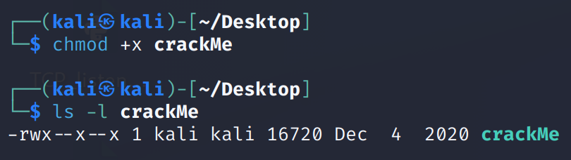
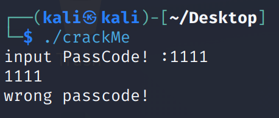
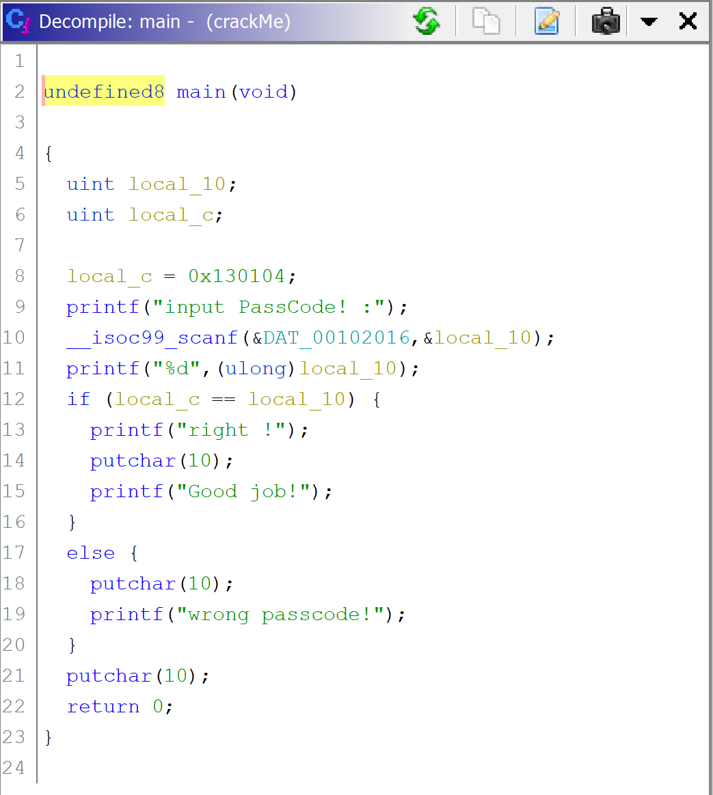
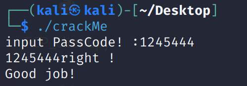

Download and extract the file  
We got an unknown file extention named crackMe   
Use TrIDNET to identify its type  
  
 
The file type is elf which is executable in linux  
  
By running the command file in linux we can double check its type  
  
  
But the file doesn't have execute permession  
  
  
We can add execute permissions with the command chmod  

  
Then we run the executable file. It prompts us to enter a passcode. I tried a random number and it was wrong  
  
  
Load the file into Ghidra to analyze  
  
 
This the main function and we can see 2 variables local_c and local_10 (it can be different names with you)  
There is a hardcoded value stored in local_c and then it is compared with the value in local_10. Local_10 is the input which is the user enters  
  
So it the hardcoded value must be the passcode. Since it is in hex we will convert it to decimal and try again  

