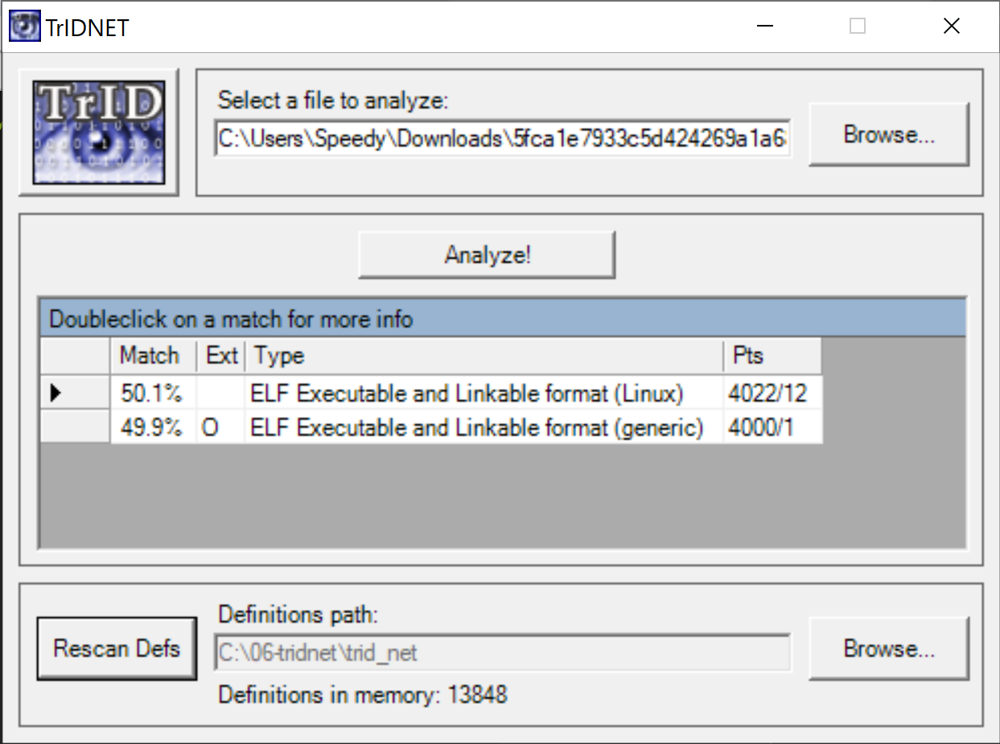
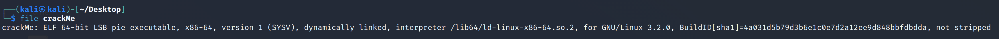
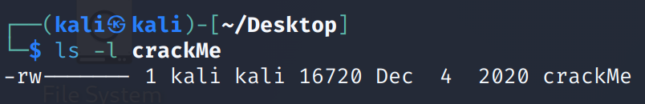

Download and extract the file  
We got an unknown file extention named crackMe   
Use TrIDNET to identify its type  
  
The file type is elf which is executable in linux  
  
By running the command file in linux we can double check its type  
  
  
But the file doesn't have execute permession  

