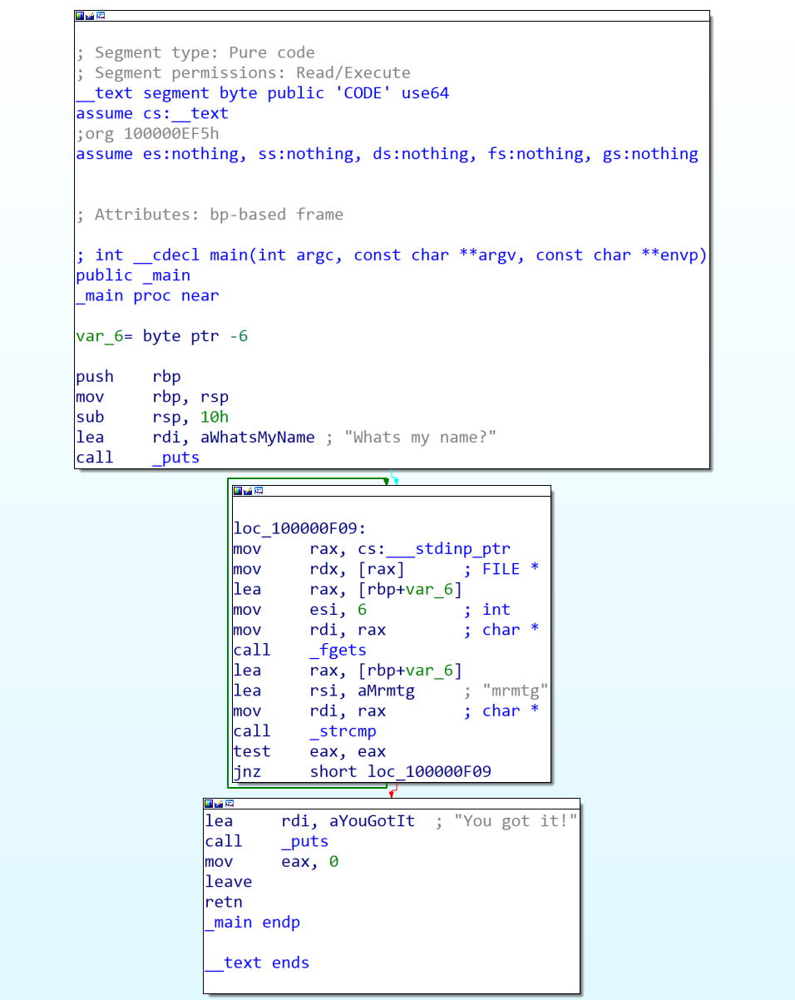
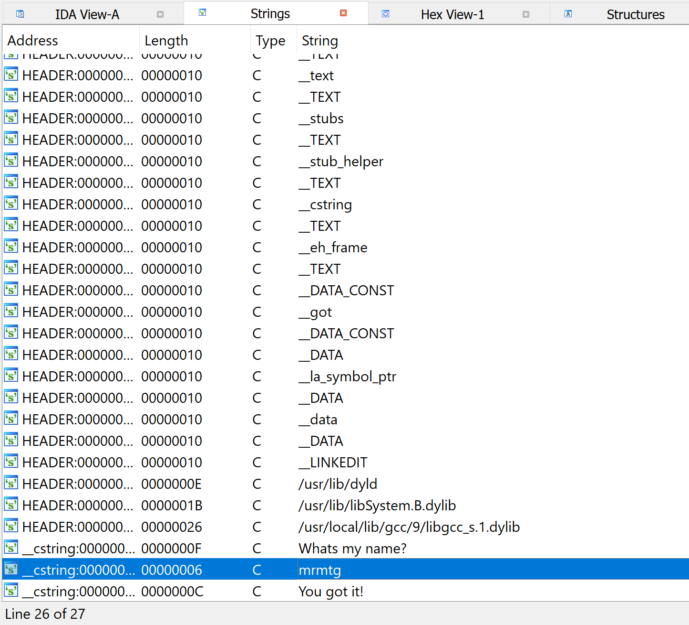

When we download and extract the file, we will find a file called "guess_my_name"  
Let's load it into IDA  
It is a very simple code as we see and there are some interesting strings  
  
  
By exploring strings section we find the name "mrmtg"  

