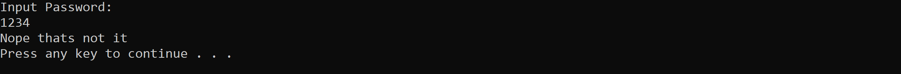
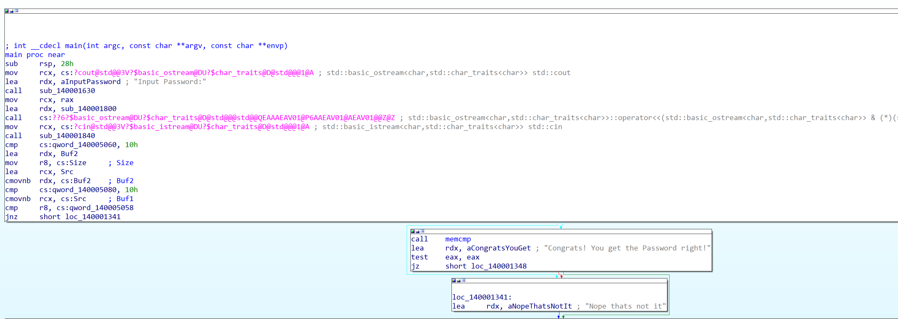
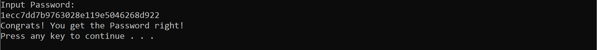

First we downlad and extract the file, then we will get a file called "simple.exe"  
When we run it, it prompts us to enter a password  
  
  
Load the exe file into IDA to see the main fucntion  
  
We can see there is if condition which compares the value in R8 with qword_140005058  
If they are not equal it will jump to loc_140001341 to print that it is not the correct password  
So we need to check the value in R8 by viewing Strings (press shift + F12)

We can see a hardcoded password in the address 140003438  
  
Finally, we try that password and it is correct  

