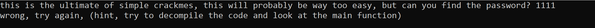
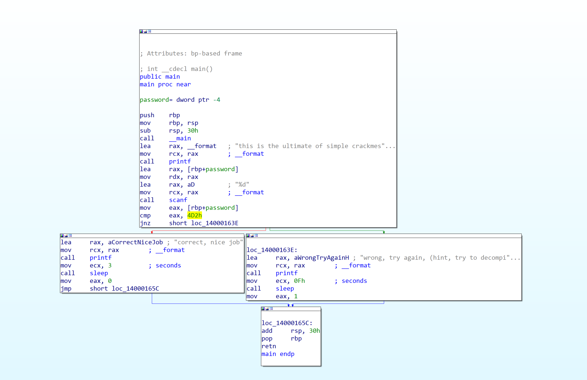
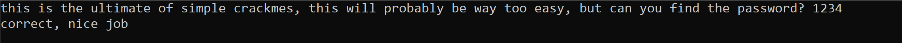

After downloading and extracting the file we find a file called "easiest_crackme.exe.exe"  
When we run it, it prompts us to enter a password so we try any password and we get this result  
  
By opening the exe file in IDA and go to the main function we can see it compares eax with "4D2h" which is hex number equals "1234" in decimal
  
Now, we try the passowrd "1234" and it is correct  

