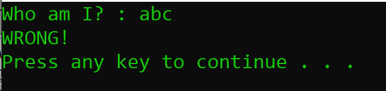
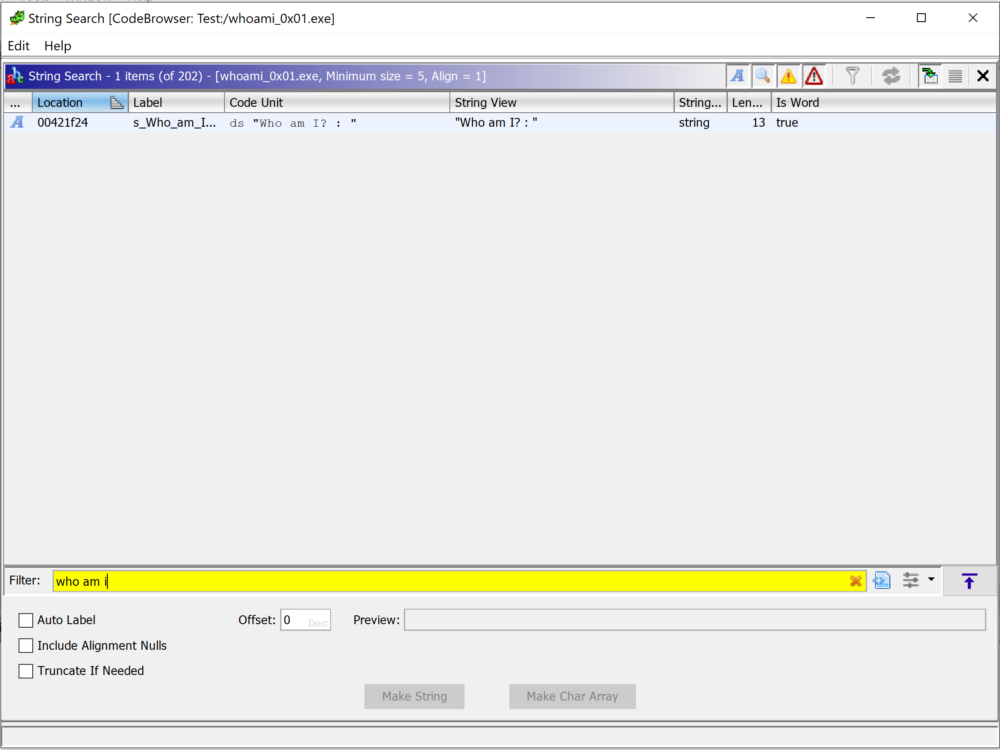
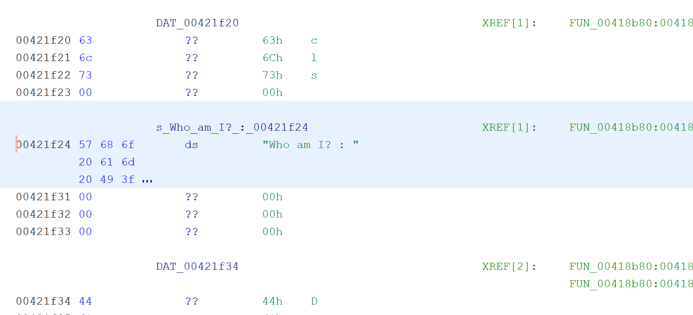
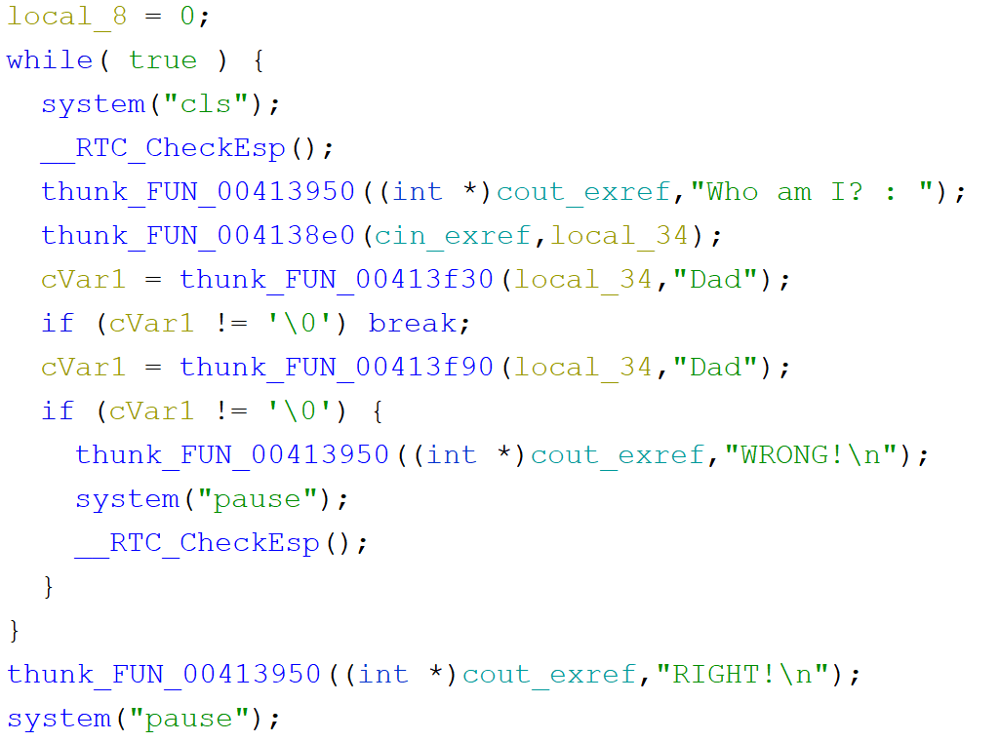
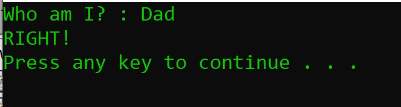

Downlwoad and extract the file to get a file called "whoami_0x01.exe"  
When we run the file it prompts us to answer the question "Who am I?"  
when we enter a random answer it replis with "Wrong"  
  
  
Let's load it into Ghidra and search for strings for any keyword like "who am i"  
  
  
Click on it to go to its location in the memory  
  
  
It is in the function called "FUN_00418b80"  
Click on the fucntion to open it in the decomplier  
We can find it compares the user input with the word "Dad"  
  
  
Now let's try the word we found  

